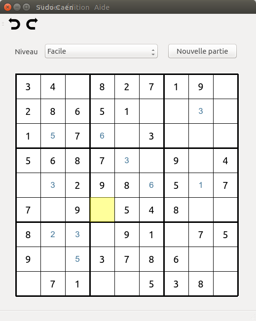

# Sudoku

## Authors

 - Yann Pellegrini
 - Pierre Gabon

## Licence

  Creative commons CC-BY-SA

## Features

 - Prevents mistakes such as placing a number when it is already in the row
 - Keyboard navigation
 - 200 built-in levels of 3 different difficulties
 - Timer
 - Scores
 - Translated in English and in French.

## Preview



## Building

```bash
mkdir build
cd build
qmake ..
make
```

## Running

`./sudoku`
